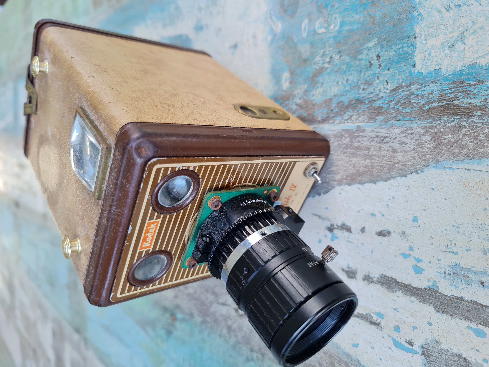
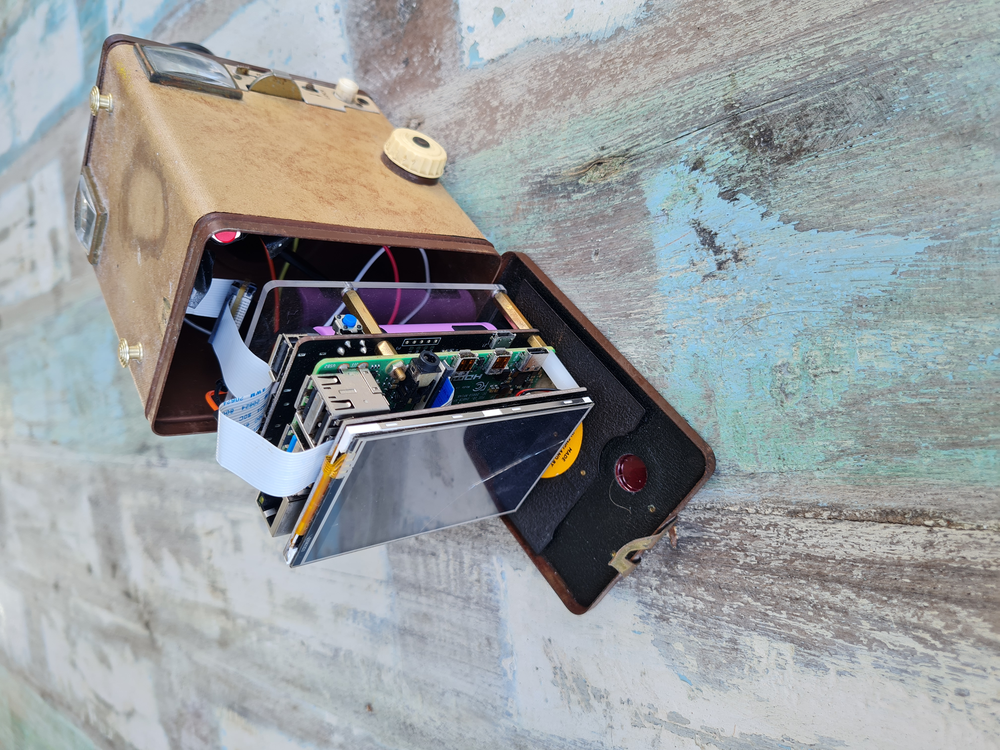
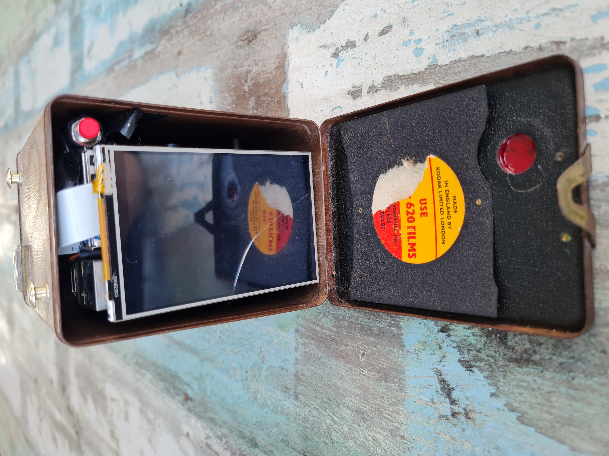
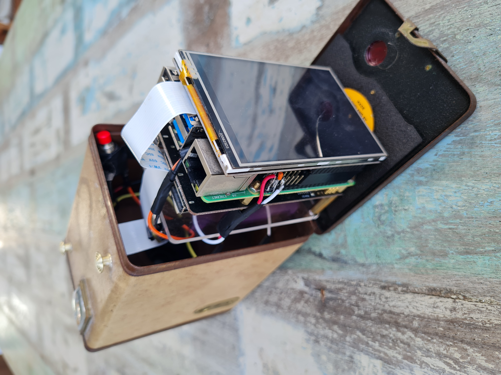
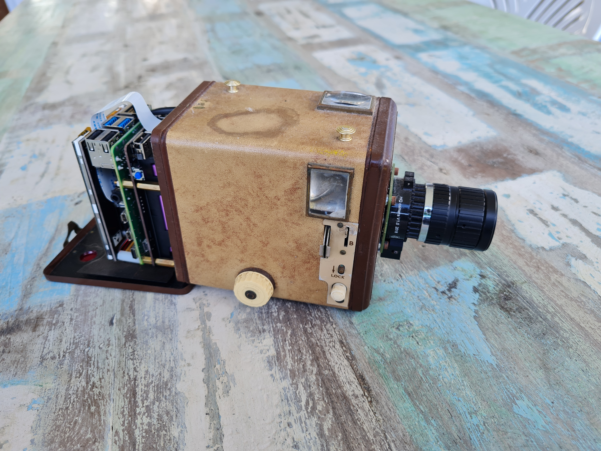
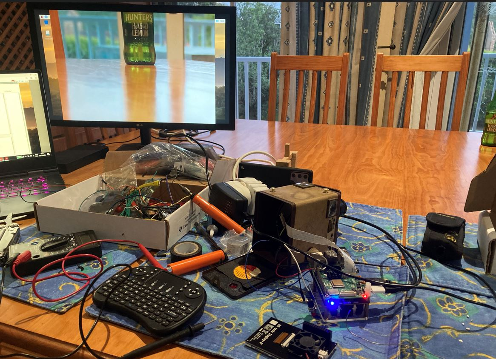

# Raspberry-Pi-Camera
Raspberry Pi Camera

I thought my grandfathers Kodak Browney IV could use a modern upgrade. 

Thanks to a Raspberry Pi Circuit Board and some Python code, I was uble to build a HD Camera that can now take 12MP digital photos and videos.

